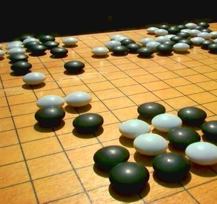

author: Kevin W. Gisi
company: Twin Cities Code Camp 8&mdash;April 10, 2010
title: Introduction to Go
subtitle:
footer: <a href='http://www.kevingisi.com'>Blog</a> | <a href='http://speakerrate.com/talks/2116-introduction-to-go'>SpeakerRate</a> | <a href="http://github.com/gisikw-slides/introduction-to-go">Source Code</a>
subfooter: Copyright &copy; 2010 by Kevin W. Gisi
slides-url: http://gisikw-slides.github.com/introduction-to-go/
code-engine: uv
code-theme: all_hallows_eve
code-line-numbers: false

# Summary

Go is a brand-spanking-new systems language that Google released in November, 2009. Every wonder how awesome C would be if it was garbage-collected, concurrent, and didn't take a few weeks to compile? Wake up; it's here! We'll take a look at this new language that steals some of the dynamic flexibility of Python and Ruby, the performance of C, and a compile time that you'll miss if you blink.

# Hello, world
<%= code 'code/hello_world.go', :lang => "go" %>

# Why Go?

- It's a systems language
- It's fun, like dynamic languages

# We Already Have a Systems Language!
Like C
<%= code 'code/c.c', :lang => "c" %>

# We Already Have Fun Languages!
<%= code 'code/ruby.rb' %>

# Fun Languages are Slow at Runtime

# Fast Languages are Slow to Compile

# Alternative: Go
<s>Go is slow at runtime AND at compile time!</s>

- 1/2&mdash;1/3 LOC for C++ benchmarks
- 1&mdash;1/16 of the speed (libraries?)

Priorities:
- Compile time
- Performance
- Readability

# It Runs on Linux 

# It Runs on OS X!

# It Runs on Virtual Machines!

# Specifications

- Compiled
- Imperative, structured
- Concurrent
- Strongly typed (explicit or inferred)

# Variables &amp; Types
- int, float
- int8, int32, float64
- uint, ufloat
- string
- struct

# Variables: Pointers and Arrays
Pointers
- Use them for reference
- DON'T manipulate them!

Arrays
<%= code 'code/variables.go#arrays', :lang => 'go' %>

# Variables: Slices and Maps 
Slices
- "Pointers" for arrays
- Contains pointers to each object in a range of the array
- Used for passing array values by reference

Maps
<%= code 'code/variables.go#maps', :lang => 'go' %>

# Variable Declaration

<%= code 'code/variables.go#declarations', :lang => "go" %>

# Variable Allocation
new()
- allocates heap space
- zero-initializes the space
- returns the address

make()
- allocates heap space
- creates the object (and underlying data structure)
- returns the value

# Go &#8800; C
- Semicolons optional (implied)
- Curly braces MUST start on the same line
- No parentheses in <code>if</code>s and <code>for</code>s
- Garbage collected
- Arrays aren't pointers

# Functions
- CamelCase - public
- camelCase - package-level
- Pass by value
- Multiple return values

# What? Multiple Return Values?!
<%= code 'code/functions.go#multiple_return', :lang => 'go' %>
How do we access them?
<%= code 'code/functions.go#call_gimme_five', :lang => 'go' %>

# Why Multiple Return Values?
<%= code 'code/functions.go#why_multiple', :lang => 'go' %>

# Named Results
<%= code 'code/functions.go#named_results', :lang => 'go' %>

# Methods
Write functions that operate on particular data
<%= code 'code/functions.go#method', :lang => 'go' %>

# Interfaces
- Similar to Java
- Definition of acceptable types
- Types don't "implement" anything

# Interfaces
<%= code 'code/interfaces.go#interface', :lang => 'go' %>

# Interface Embedding
<%= code 'code/interfaces.go#interface_embedding', :lang => 'go' %>

# Struct Embedding
<%= code 'code/interfaces.go#struct_embedding', :lang => 'go' %>

# Concurrency

# Goroutines
- NOT threads
- Independent code
- Communication over shared memory

# Threads
- Exist
- Span across multiple cores
- Go load-balances them
- Don't worry about it

# Goroutine Example
<%= code 'code/concurrency.go#goroutines', :lang => 'go' %>
- No access to spawned goroutines
- No thread.join equivalent

# Channels

- Like Unix pipes
- Communicate across goroutines
- Optionally blocking/non-blocking

# Channel Example: Communication
<%= code 'code/concurrency.go#channels', :lang => 'go' %>

# Channel Example: Asynchronous
<%= code 'code/concurrency.go#asynchronous_channels', :lang => 'go' %>

# Channel Example: Semaphore
<%= code 'code/concurrency.go#semaphore', :lang => 'go' %>

# Channel Example: Thread.join
<%= code 'code/concurrency.go#thread_join', :lang => 'go' %>

# Packages and Libraries
- os
- net
- websocket
- math
- strings
- bufio
- encoding
- json
- testing
- regexp

# What Should You Use It For?
- Not yet ready for production use
- Systems work
- High performance
- Fun!

Help develop libraries you want to see!

# Additional Information
- <a href='http://golang.org'>http://golang.org</a>
- <a href='http://code.google.com/p/go/wiki/WikiIndex'>Go Wiki</a>
- <a href="http://www.youtube.com/watch?v=rKnDgT73v8s'>Google Tech Talk</a>

# Questions? Comments?

Thank you!

Kevin W. Gisi

&lt;<a href='mailto:kevin@kevingisi.com'>kevin@kevingisi.com</a>&gt;
